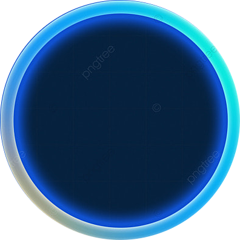

# Rush City Eats 🍽️

<div align="center">
  
</div>

## 🚀 About

Rush City Eats is a modern, fast, and efficient food delivery web application built with cutting-edge technologies. Experience seamless food ordering with our intuitive interface and real-time delivery tracking.

## ✨ Features

- 🎯 Intuitive and responsive design
- 🔍 Advanced restaurant and dish search
- 🛒 Seamless cart management
- 📍 Real-time order tracking
- 💳 Secure payment integration
- 📱 Mobile-first approach

## 🛠️ Tech Stack

- **Frontend:** React 18, TypeScript
- **Styling:** Tailwind CSS
- **UI Components:** Radix UI, Shadcn
- **State Management:** React Query
- **Form Handling:** React Hook Form, Zod
- **Routing:** React Router DOM
- **Charts:** Recharts
- **Date Handling:** date-fns
- **Build Tool:** Vite

## 🚀 Getting Started

1. Clone the repository:
```bash
git clone [repository-url]
```

2. Install dependencies:
```bash
npm install
# or
yarn install
# or
bun install
```

3. Start the development server:
```bash
npm run dev
# or
yarn dev
# or
bun dev
```

4. Open [http://localhost:5173](http://localhost:5173) in your browser.

## 📱 Mobile Apps

<div style="display: flex; justify-content: center; gap: 20px;">
  <a href="#" target="_blank">
    
  </a>
  <a href="#" target="_blank">
    
  </a>
</div>

## 🤝 Contributing

Contributions are welcome! Please feel free to submit a Pull Request.

## 📄 License

This project is licensed under the MIT License - see the [LICENSE](LICENSE) file for details.

## 💫 Support

For support, email support@rushcityeats.com or join our Slack channel.

---

<div align="center">
  Made with ⚡️ by the Rush City Eats Team
</div>